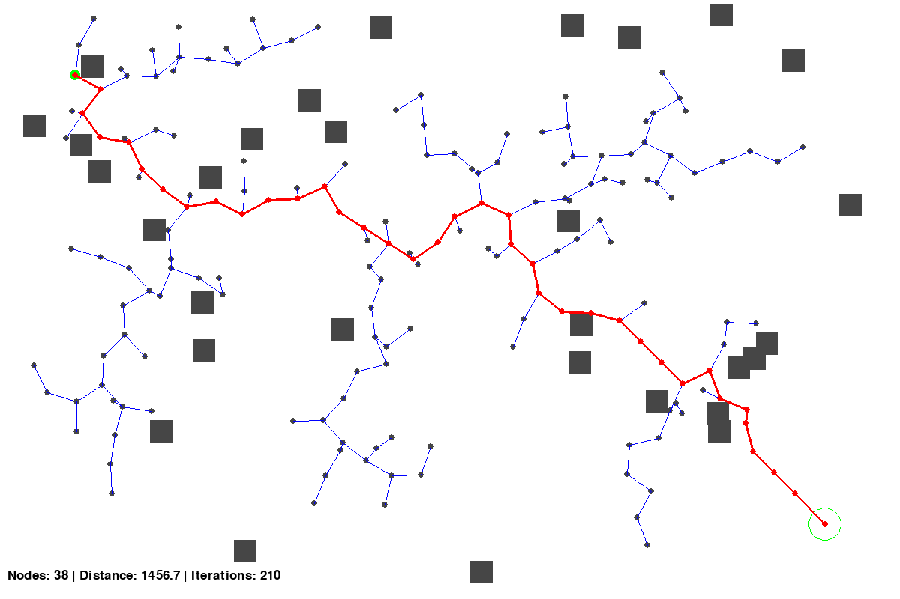
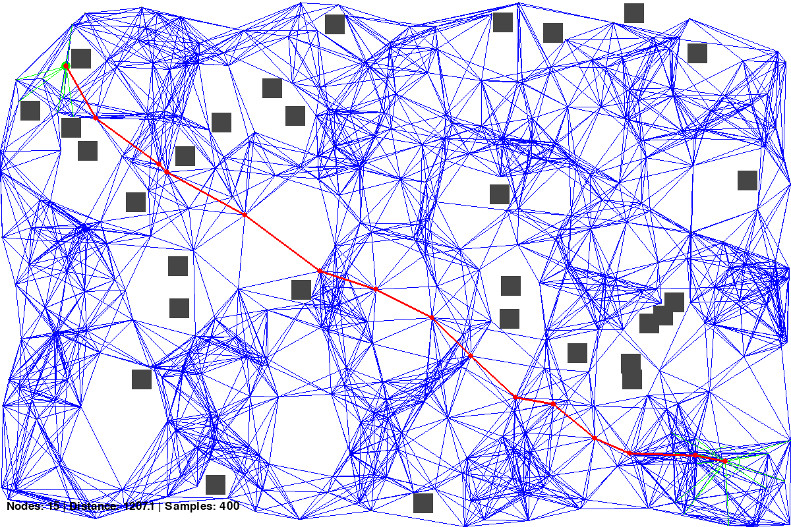
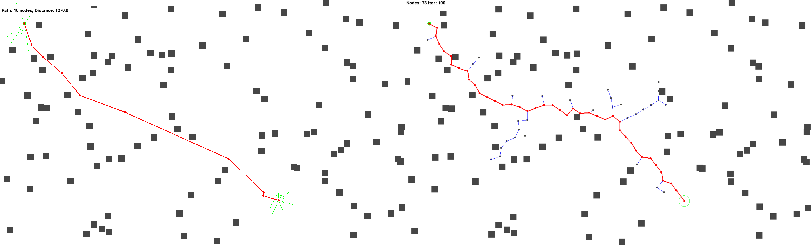

# RRT-PRM-Hybrid

TUKE - NMvR Assignment

Path planning algorithms implementation and comparison for mobile robotics.

## Structure

```
RRT-PRM-Hybrid/
├── core/                 # Generalized base classes for path planning
│   ├── graph.py          # Abstract graph structure
│   ├── environment.py    # Obstacle handling and collision detection
│   └── visualization.py  # Pygame-based visualization
├── rrt_src/              # RRT algorithm implementation
│   ├── rrt.py            # Main RRT execution
│   └── rrt_graph.py      # RRT-specific graph logic
├── prm_src/              # PRM algorithm implementation
│   ├── prm.py            # Main PRM execution
│   └── prm_graph.py      # PRM-specific graph logic
└── figures/              # Output visualizations
```

## Algorithms

### RRT (Rapidly-exploring Random Tree)

**Algorithm Overview:**
- Incrementally builds a tree by randomly sampling the configuration space
- Connects new samples to the nearest existing node
- Uses goal biasing to improve convergence
- Continues until a path to the goal is found

**Implementation Structure:**
- `RRTGraph`: Extends `Graph` base class with RRT-specific tree expansion logic
- `expand()`: Random sampling and tree growth
- `bias_towards_goal()`: Goal-biased sampling for faster convergence
- Configurable step size and goal bias probability

**Usage:**
```python
python rrt_src/rrt.py
```

**Parameters:**
- `dimensions`: Environment size (height, width)
- `start`: Starting position (x, y)
- `goal`: Goal position (x, y)
- `obstacle_size`: Size of square obstacles
- `obstacle_count`: Number of random obstacles
- `step_size`: Maximum extension distance (default: 35)
- `goal_bias`: Probability of sampling toward goal (default: 0.1)

**Example Output:**



*RRT algorithm exploring the space with tree expansion (blue) and final path (red)*

### PRM (Probabilistic Roadmap)

**Algorithm Overview:**
- Pre-computes a roadmap of collision-free configurations
- Three-phase approach: sampling, connection, and query
- Samples random points in free space and connects nearby neighbors
- Searches the roadmap using A* to find optimal path

**Implementation Structure:**
- `PRMGraph`: Extends `Graph` base class with roadmap construction and A* search
- `build_roadmap()`: Sample N collision-free points and connect to k-nearest neighbors
- `add_start_goal()`: Connect start and goal positions to the roadmap
- `find_path()`: A* search to find optimal path through roadmap

**Key Features:**
- Multi-query efficiency (roadmap can be reused)
- k-nearest neighbor connectivity
- Bidirectional edge graph structure
- A* pathfinding with Euclidean heuristic

**Usage:**
```python
python prm_src/prm.py
```

**Parameters:**
- `dimensions`: Environment size (height, width)
- `start`: Starting position (x, y)
- `goal`: Goal position (x, y)
- `obstacle_size`: Size of square obstacles
- `obstacle_count`: Number of random obstacles
- `num_samples`: Number of roadmap samples (default: 500)
- `k_neighbors`: Neighbors to connect per sample (default: 10)
- `show_roadmap`: Visualize full roadmap (default: False, recommended for large roadmaps)

**Example Output:**



*PRM algorithm with pre-computed roadmap (blue) and optimal path (red)*

### Hybrid Algorithm
*To be implemented*

## Algorithm Comparison



*Side-by-side comparison: RRT (right) explores incrementally, PRM (left) pre-computes a reusable roadmap*

## Core Architecture

The `core` module provides reusable components for all path planning algorithms:

- **Graph**: Abstract base class defining tree/graph operations
- **Environment**: Obstacle generation and collision detection
- **MapVisualizer**: Pygame-based visualization for algorithm execution